<div align="center">


# Auth Agent - OAuth 2.1 for AI Agents

**Standardized authentication for autonomous AI agents**

[](https://opensource.org/licenses/MIT)
[](https://www.typescriptlang.org/)
[](https://workers.cloudflare.com/)
[](https://supabase.com/)

A specialized OAuth 2.1 authorization server designed for autonomous AI agents. Unlike traditional OAuth flows that require human interaction, Auth Agent enables AI agents to authenticate themselves programmatically while maintaining enterprise-grade security through PKCE and credential verification.

</div>

---

## 🎥 Video Demos

Watch Auth Agent in action:

### Demo 1: Profilio Integration
AI agent authenticating on Profilio platform using browser-use.


### Demo 2: Crypto Exchange Dashboard
Authentication flow on crypto trading platform.


### Demo 3: GitHub Clone Website
Full OAuth flow on GitHub-style repository dashboard.


## ✨ Features

- **🔐 OAuth 2.1 Compliant** - Full implementation with PKCE required
- **🤖 AI Agent Authentication** - Agents authenticate using `agent_id` + `agent_secret`
- **⚡ No User Consent** - Streamlined for autonomous agents (consent handled during onboarding)
- **🎫 JWT Access Tokens** - Stateless token validation with JWT (HS256)
- **🔄 Refresh Tokens** - Long-lived sessions with opaque refresh tokens
- **🔍 Token Introspection** - RFC 7662 compliant token validation
- **🗑️ Token Revocation** - RFC 7009 compliant token revocation
- **📋 OAuth Discovery** - RFC 8414 metadata endpoint
- **🌐 Edge Deployment** - Global deployment on Cloudflare Workers + Supabase PostgreSQL
- **📦 SDK Support** - TypeScript & Python SDKs for easy integration

## 🛠️ Tech Stack

### Backend & Infrastructure
- **[Convex](https://convex.dev)** - Serverless backend, database, and HTTP functions
- **[TypeScript](https://www.typescriptlang.org/)** - Type-safe development
- **[Node.js](https://nodejs.org/)** - Runtime for crypto operations
- **[JWT](https://jwt.io/)** - JSON Web Tokens for stateless authentication

### Frontend & Client SDKs
- **[Next.js](https://nextjs.org/)** - React framework for demo websites
- **[React](https://react.dev/)** - UI components and SDK widgets
- **[TypeScript](https://www.typescriptlang.org/)** - Type-safe client SDK
- **[Tailwind CSS](https://tailwindcss.com/)** - Styling for demo websites

### AI Agent Integration
- **[Python](https://www.python.org/)** - Agent SDK and browser automation
- **[browser-use](https://browser-use.com/)** - Browser automation framework
- **[aiohttp](https://docs.aiohttp.org/)** - Async HTTP client for agents

### Database & Storage
- **[Convex Database](https://convex.dev)** - Serverless, real-time database
- **[Supabase](https://supabase.com/)** - Used in Profilio integration demo

### Deployment
- **[Vercel](https://vercel.com/)** - Frontend deployment (demo websites)
- **[Convex Cloud](https://convex.dev)** - Backend deployment (serverless)

### Security & Cryptography
- **PBKDF2** - Password hashing for secrets
- **SHA-256** - PKCE code challenge hashing
- **HS256** - JWT signing algorithm
- **bcrypt** - Additional credential hashing

## 🔄 Complete OAuth 2.1 Workflow


## 🏗️ Backend Architecture & OAuth Flow

This diagram shows the complete backend architecture and how all components interact during the OAuth flow:

```mermaid
graph TB
    subgraph "AI Agent Environment"
        Agent[🤖 AI Agent<br/>browser-use]
        AgentSDK[📦 Agent SDK<br/>Python/TypeScript]
    end

    subgraph "Website (Client)"
        Website[🌐 Website<br/>Next.js]
        ClientSDK[📦 Client SDK<br/>React Component]
        Callback[🔄 Callback Handler<br/>/auth-agent/callback]
        TokenExchange[🔐 Token Exchange API<br/>/api/auth-agent/exchange]
    end

    subgraph "Auth Agent Server (Convex)"
        subgraph "HTTP Endpoints"
            Authorize[/authorize<br/>GET - OAuth Authorization]
            Token[/token<br/>POST - Token Exchange]
            AgentAuth[/api/agent/authenticate<br/>POST - Agent Verification]
            StatusCheck[/api/check-status<br/>GET - Status Polling]
            Introspect[/introspect<br/>POST - Token Validation]
            Revoke[/revoke<br/>POST - Token Revocation]
            Discovery[/.well-known/oauth-authorization-server<br/>GET - OAuth Discovery]
        end

        subgraph "Crypto Actions (Node.js)"
            PBKDF2Hash[🔒 PBKDF2 Hashing<br/>hashSecretAction]
            PBKDF2Verify[✅ Secret Verification<br/>verifySecretAction]
            PKCEValidate[🔑 PKCE Validation<br/>validatePKCEAction]
            JWTGenerate[🎫 JWT Generation<br/>generateJWTAction]
            RandomGen[🎲 Secure Random<br/>generateSecureRandomAction]
        end

        subgraph "Database (Convex)"
            AuthRequests[(📋 Auth Requests<br/>code_challenge, state)]
            AuthCodes[(🔐 Authorization Codes<br/>code, request_id)]
            Tokens[(🎫 Tokens<br/>access_token, refresh_token)]
            Agents[(🤖 Agents<br/>agent_id, agent_secret_hash)]
            Clients[(🌐 Clients<br/>client_id, client_secret_hash)]
        end

        subgraph "Templates"
            SpinningPage[⚙️ Spinning Page<br/>window.authRequest]
            ErrorPage[❌ Error Page<br/>OAuth Errors]
        end
    end

    %% OAuth Flow
    Agent -->|1. Navigate & Click| Website
    Website -->|2. Generate PKCE| ClientSDK
    ClientSDK -->|3. Redirect to /authorize| Authorize
    Authorize -->|4. Validate client_id| Clients
    Authorize -->|5. Create auth request| AuthRequests
    Authorize -->|6. Return spinning page| SpinningPage
    SpinningPage -->|7. Agent reads| Agent
    Agent -->|8. Extract request_id| AgentSDK
    AgentSDK -->|9. POST credentials| AgentAuth
    AgentAuth -->|10. Verify agent| Agents
    AgentAuth -->|11. PBKDF2 verify| PBKDF2Verify
    AgentAuth -->|12. Mark authenticated| AuthCodes
    Agent -->|13. Poll status| StatusCheck
    StatusCheck -->|14. Check auth status| AuthCodes
    AuthCodes -->|15. Return authenticated| Agent
    Agent -->|16. Redirect with code| Callback
    Callback -->|17. Exchange code| TokenExchange
    TokenExchange -->|18. POST /token| Token
    Token -->|19. Validate PKCE| PKCEValidate
    Token -->|20. Verify client| Clients
    Token -->|21. Verify secret| PBKDF2Verify
    Token -->|22. Generate JWT| JWTGenerate
    Token -->|23. Generate refresh| RandomGen
    Token -->|24. Store tokens| Tokens
    Token -->|25. Return tokens| TokenExchange
    TokenExchange -->|26. Store in localStorage| Website
    Website -->|27. Redirect to dashboard| Agent

    %% Styling
    classDef agentClass fill:#4A90E2,stroke:#2E5C8A,stroke-width:2px,color:#fff
    classDef websiteClass fill:#50C878,stroke:#2E7D4F,stroke-width:2px,color:#fff
    classDef serverClass fill:#9B59B6,stroke:#6C3483,stroke-width:2px,color:#fff
    classDef cryptoClass fill:#E74C3C,stroke:#A93226,stroke-width:2px,color:#fff
    classDef dbClass fill:#F39C12,stroke:#B9770E,stroke-width:2px,color:#fff
    classDef templateClass fill:#3498DB,stroke:#2471A3,stroke-width:2px,color:#fff

    class Agent,AgentSDK agentClass
    class Website,ClientSDK,Callback,TokenExchange websiteClass
    class Authorize,Token,AgentAuth,StatusCheck,Introspect,Revoke,Discovery serverClass
    class PBKDF2Hash,PBKDF2Verify,PKCEValidate,JWTGenerate,RandomGen cryptoClass
    class AuthRequests,AuthCodes,Tokens,Agents,Clients dbClass
    class SpinningPage,ErrorPage templateClass
```

## 🛠️ Tech Stack Architecture

This diagram illustrates all technologies, frameworks, and how they connect:

```mermaid
graph TB
    subgraph "Frontend Layer"
        subgraph "Demo Websites"
            GitHub[📦 GitHub Clone<br/>Next.js + React]
            Crypto[📈 Crypto Exchange<br/>Next.js + React]
            Ecommerce[🛒 E-commerce<br/>Next.js + React]
        end

        subgraph "Client SDK"
            ReactSDK[⚛️ React Component<br/>AuthAgentButton]
            TypeScriptSDK[📘 TypeScript SDK<br/>Client Library]
        end
    end

    subgraph "AI Agent Layer"
        subgraph "Browser Automation"
            BrowserUse[🌐 browser-use<br/>Browser Automation]
            Puppeteer[🤖 Puppeteer<br/>Alternative]
            Selenium[⚙️ Selenium<br/>Alternative]
        end

        subgraph "Agent SDK"
            PythonSDK[🐍 Python SDK<br/>Agent Library]
            TSAgentSDK[📘 TypeScript SDK<br/>Agent Library]
        end
    end

    subgraph "Backend Layer (Convex)"
        subgraph "HTTP Functions"
            OAuthEndpoints[🔐 OAuth Endpoints<br/>15+ Routes]
            AdminEndpoints[⚙️ Admin Endpoints<br/>Agent/Client Mgmt]
            DiscoveryEndpoints[📋 Discovery<br/>.well-known]
        end

        subgraph "Serverless Actions"
            CryptoActions[🔒 Crypto Actions<br/>Node.js Runtime]
        end

        subgraph "Database"
            ConvexDB[(🗄️ Convex Database<br/>Real-time)]
        end

        subgraph "Security"
            PBKDF2[🔐 PBKDF2<br/>Secret Hashing]
            PKCE[🔑 PKCE<br/>SHA-256]
            JWT[🎫 JWT<br/>HS256 Signing]
        end
    end

    subgraph "Deployment"
        Vercel[▲ Vercel<br/>Website Hosting]
        ConvexCloud[☁️ Convex Cloud<br/>Serverless Backend]
    end

    subgraph "Technologies"
        TypeScript[📘 TypeScript<br/>Type Safety]
        NodeJS[🟢 Node.js<br/>Crypto Runtime]
        Python[🐍 Python<br/>Agent SDK]
        React[⚛️ React<br/>UI Components]
        NextJS[▲ Next.js<br/>Web Framework]
    end

    %% Frontend connections
    GitHub --> ReactSDK
    Crypto --> ReactSDK
    Ecommerce --> ReactSDK
    ReactSDK --> TypeScriptSDK
    TypeScriptSDK --> OAuthEndpoints

    %% Agent connections
    BrowserUse --> PythonSDK
    Puppeteer --> PythonSDK
    Selenium --> PythonSDK
    PythonSDK --> OAuthEndpoints
    TSAgentSDK --> OAuthEndpoints

    %% Backend connections
    OAuthEndpoints --> CryptoActions
    AdminEndpoints --> ConvexDB
    OAuthEndpoints --> ConvexDB
    CryptoActions --> PBKDF2
    CryptoActions --> PKCE
    CryptoActions --> JWT

    %% Deployment
    GitHub --> Vercel
    Crypto --> Vercel
    Ecommerce --> Vercel
    OAuthEndpoints --> ConvexCloud
    AdminEndpoints --> ConvexCloud
    ConvexDB --> ConvexCloud

    %% Technology usage
    GitHub --> NextJS
    Crypto --> NextJS
    Ecommerce --> NextJS
    ReactSDK --> React
    TypeScriptSDK --> TypeScript
    PythonSDK --> Python
    CryptoActions --> NodeJS
    OAuthEndpoints --> TypeScript

    %% Styling
    classDef frontendClass fill:#4A90E2,stroke:#2E5C8A,stroke-width:2px,color:#fff
    classDef agentClass fill:#50C878,stroke:#2E7D4F,stroke-width:2px,color:#fff
    classDef backendClass fill:#9B59B6,stroke:#6C3483,stroke-width:2px,color:#fff
    classDef deployClass fill:#E74C3C,stroke:#A93226,stroke-width:2px,color:#fff
    classDef techClass fill:#F39C12,stroke:#B9770E,stroke-width:2px,color:#fff
    classDef securityClass fill:#1ABC9C,stroke:#138D75,stroke-width:2px,color:#fff

    class GitHub,Crypto,Ecommerce,ReactSDK,TypeScriptSDK frontendClass
    class BrowserUse,Puppeteer,Selenium,PythonSDK,TSAgentSDK agentClass
    class OAuthEndpoints,AdminEndpoints,DiscoveryEndpoints,CryptoActions,ConvexDB backendClass
    class Vercel,ConvexCloud deployClass
    class TypeScript,NodeJS,Python,React,NextJS techClass
    class PBKDF2,PKCE,JWT securityClass
```



### Key Differences from Traditional OAuth

**Traditional OAuth (for humans):**
1. User clicks "Sign in"
2. User redirected to auth server
3. **User enters credentials manually** ❌
4. **User approves consent screen** ❌
5. User redirected back with code

**Auth Agent (for AI):**
1. AI Agent clicks "Sign in" (automated)
2. Browser redirected to auth server
3. **Agent detects auth page programmatically** ✅
4. **Agent POSTs credentials via API** ✅
5. Browser auto-redirects back with code

## 🚀 Quick Start

### 1. Install Dependencies

```bash
npm install
```

### 2. Configure Environment Variables

**⚠️ Important:** All `.env*` files are gitignored. You need to create your own `.env` files from the provided `.env.example` templates.

```bash
# Copy environment variable template
cp .env.example .env

# Edit .env with your actual credentials
# See Configuration section below for details
```

### 3. Deploy to Convex

```bash
# Install Convex CLI if you haven't
npm install -g convex

# Login to Convex
npx convex login

# Deploy
npx convex deploy
```

### 4. Seed Test Data

```bash
npm run seed
```

This creates:
- A test agent with credentials
- A test client (website)
- Saves credentials to `test-credentials.json`

### 5. Test the Flow

```bash
npm test
```

Runs a complete OAuth flow simulation.

## 📚 Documentation

- **[SDK Documentation](./sdk/README.md)** - Client and agent SDKs
- **[Browser-Use Integration](./examples/browser-use-integration/README.md)** - AI agent authentication examples
- **[Demo Websites](./websites/README.md)** - Three integrated demo websites
- **[Hackathon Pitch Guide](./HACKATHON_PITCH.md)** - Presentation materials

## 🔌 API Endpoints

### Public OAuth Endpoints

#### `GET /authorize`
Standard OAuth 2.1 authorization endpoint. Shows spinning page while agent authenticates.

**Query Parameters:**
- `client_id` - OAuth client identifier
- `redirect_uri` - Callback URL
- `response_type` - Must be "code"
- `state` - CSRF protection token
- `code_challenge` - PKCE challenge (S256)
- `code_challenge_method` - Must be "S256"
- `scope` - Optional, defaults to "openid profile"

#### `POST /token`
Exchange authorization code for tokens, or refresh access token.

**Body (authorization_code grant):**
```json
{
  "grant_type": "authorization_code",
  "code": "code_xxx",
  "code_verifier": "...",
  "client_id": "client_xxx",
  "client_secret": "..."
}
```

**Body (refresh_token grant):**
```json
{
  "grant_type": "refresh_token",
  "refresh_token": "rt_xxx",
  "client_id": "client_xxx",
  "client_secret": "..."
}
```

#### `POST /introspect`
Validate and get information about a token (RFC 7662).

```json
{
  "token": "eyJhbG...",
  "token_type_hint": "access_token",
  "client_id": "client_xxx",
  "client_secret": "..."
}
```

#### `POST /revoke`
Revoke an access or refresh token (RFC 7009).

```json
{
  "token": "eyJhbG...",
  "token_type_hint": "access_token",
  "client_id": "client_xxx",
  "client_secret": "..."
}
```

### Agent Back-Channel Endpoints

#### `POST /api/agent/authenticate`
Agent sends credentials to complete an authorization request.

```json
{
  "request_id": "req_xxx",
  "agent_id": "agent_xxx",
  "agent_secret": "...",
  "model": "gpt-4"
}
```

#### `GET /api/check-status`
Check if agent has completed authentication (used by spinning page polling).

**Query Parameters:**
- `request_id` - The authorization request ID

### Admin Endpoints

#### Agents
- `POST /api/admin/agents` - Create new agent
- `GET /api/admin/agents` - List all agents
- `GET /api/admin/agents/:id` - Get agent details
- `DELETE /api/admin/agents/:id` - Delete agent

#### Clients
- `POST /api/admin/clients` - Create new client
- `GET /api/admin/clients` - List all clients
- `GET /api/admin/clients/:id` - Get client details
- `PUT /api/admin/clients/:id` - Update client
- `DELETE /api/admin/clients/:id` - Delete client

### Discovery Endpoints

- `GET /.well-known/oauth-authorization-server` - OAuth server metadata (RFC 8414)
- `GET /.well-known/jwks.json` - JSON Web Key Set

## ⚙️ Configuration

### Environment Variables

**Important:** All `.env*` files are gitignored for security. Never commit actual credentials to the repository.

Environment variable templates (`.env.example`) are provided for:
- **Root directory** - Auth Agent server configuration (Convex, JWT)
- **`examples/browser-use-integration/`** - AI agent credentials (AGENT_ID, AGENT_SECRET, etc.)
- **Demo websites** - OAuth client credentials for each website

To get started:

1. **Copy the relevant `.env.example` file to `.env` (or `.env.local` for Next.js projects):**
   ```bash
   # For the server
   cp .env.example .env
   
   # For browser-use examples
   cp examples/browser-use-integration/.env.example examples/browser-use-integration/.env
   
   # For demo websites (use .env.local for Next.js)
   cp websites/v0-github-clone-with-sign-in/.env.example websites/v0-github-clone-with-sign-in/.env.local
   ```

2. **Fill in your actual credentials** in the `.env` file

3. **Create agents/clients** using the provided scripts (see SDK documentation)

### Server Environment Variables

For the Convex server, configure these variables in your Convex dashboard:

```env
JWT_SECRET=your-secret-key-change-in-production
JWT_ISSUER=auth-agent.com
CONVEX_SITE_URL=https://your-project.convex.site
AGENTMAIL_API_KEY=your-agentmail-api-key  # Optional, for 2FA
```

## 🔒 Security Features

### PKCE (Proof Key for Code Exchange)
OAuth 2.1 **requires** PKCE for all authorization code flows. This prevents authorization code interception attacks.

- Code verifier: Random 128-character string
- Code challenge: SHA-256 hash of verifier
- Method: S256 (SHA-256)

### Credential Hashing
All secrets (agent_secret, client_secret) are hashed with PBKDF2 before storage. Original secrets are never stored in the database.

### JWT Tokens
Access tokens are JWTs signed with HS256, enabling stateless validation. Tokens include:
- `sub` - Agent ID
- `client_id` - OAuth client identifier
- `model` - AI model type
- `scope` - Granted permissions
- `iat` - Issued at timestamp
- `exp` - Expiration timestamp

### Opaque Refresh Tokens
Refresh tokens are random strings stored in the database, allowing easy revocation and token rotation.

### Request Expiration
Authorization requests expire after 10 minutes to prevent replay attacks.

### HTTPS Enforcement
All redirect URIs must use HTTPS (except `localhost` for development).

## 📁 Project Structure

```
Auth_Agent/
├── convex/                    # Convex serverless backend
│   ├── actions/              # Node.js runtime actions (crypto)
│   ├── lib/                  # Shared utilities
│   ├── templates/            # HTML templates (spinning page, errors)
│   ├── http.ts              # HTTP router (OAuth endpoints)
│   ├── oauth.ts             # OAuth mutations/queries
│   ├── admin.ts             # Admin endpoints
│   └── schema.ts            # Database schema
├── sdk/                      # SDKs for integration
│   ├── agent/               # AI Agent SDKs (TypeScript & Python)
│   ├── client/              # Client SDK (React components, TypeScript)
│   └── server/              # Server SDK (TypeScript)
├── examples/                 # Integration examples
│   └── browser-use-integration/  # Browser-use agent examples
├── websites/                 # Demo websites
│   ├── v0-github-clone-with-sign-in/
│   ├── v0-crypto-exchange-dashboard/
│   └── v0-e-commerce-website/
├── scripts/                  # Utility scripts
│   ├── create-agent-credentials.js
│   ├── create-*-client.js/py
│   └── seed.ts
├── logo/                     # Branding assets
├── demo/                     # Video demonstrations
└── README.md                 # This file
```

## 🌟 Demo Websites

Three fully integrated demo websites showcase Auth Agent authentication:

1. **GitHub Clone** - Repository dashboard with Auth Agent sign-in
2. **Crypto Exchange** - Trading platform authentication
3. **E-commerce** - Store management dashboard

Each includes:
- ✅ Auth Agent OAuth 2.1 sign-in button
- ✅ Callback handler for OAuth redirect
- ✅ Token exchange API route
- ✅ Session storage (localStorage for demo)
- ✅ Protected dashboard routes

See [websites/README.md](./websites/README.md) for setup instructions.

## 🤝 Contributing

Contributions welcome! This project is designed to standardize AI agent authentication across the web.

## 📄 License

MIT

## 🔗 Links

- **Repository**: https://github.com/hetpatel-11/Auth_Agent
- **Live Demo**: https://api.auth-agent.com
- **Convex Dashboard**: https://dashboard.convex.dev

---

<div align="center">

**Built with ❤️ for the AI agent community**

Standardizing authentication, one agent at a time.

</div>
