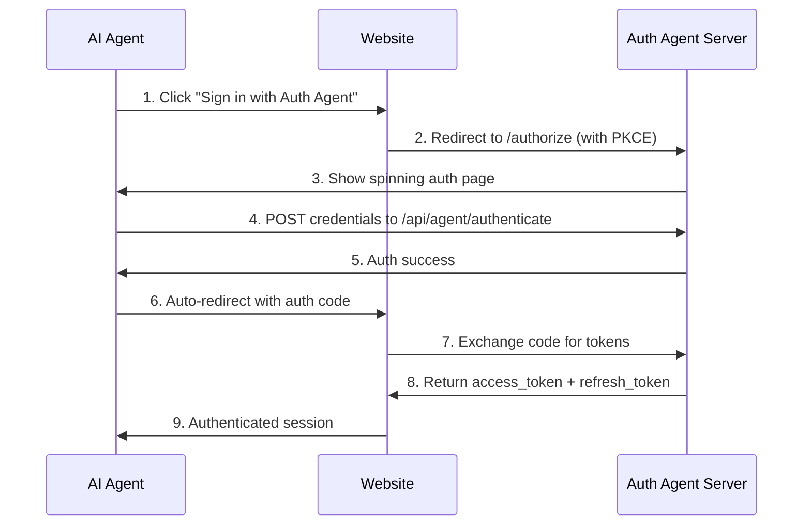
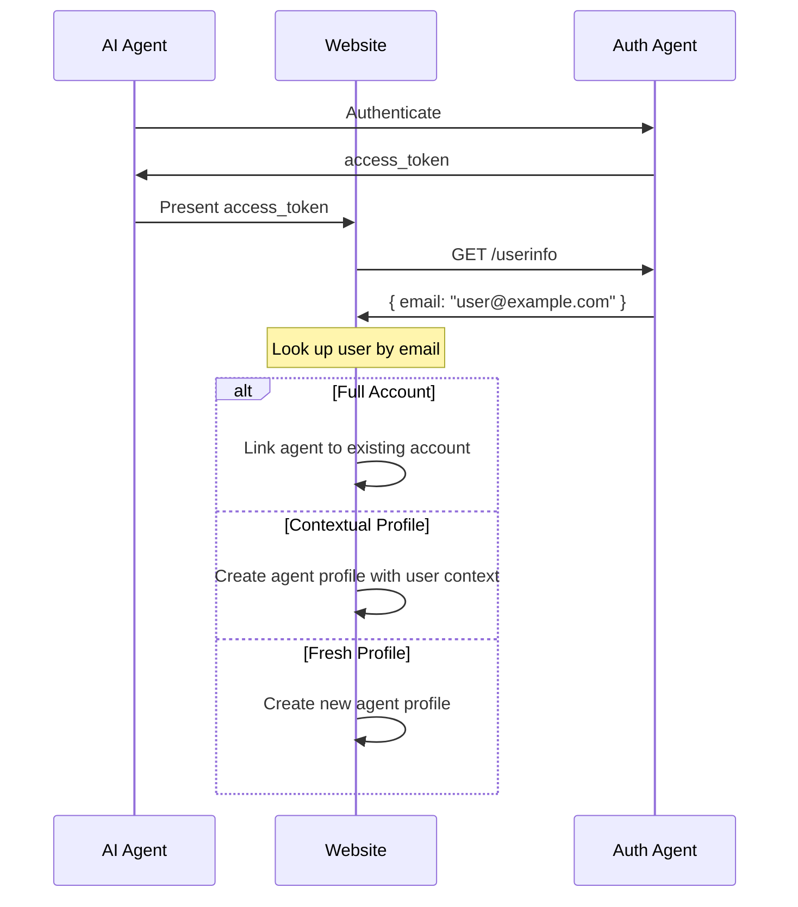

<div align="center">


# Auth Agent

**OAuth 2.1 for AI Agents**

Give your AI agents their own login. No password sharing. No cookie scraping.

[](https://opensource.org/licenses/MIT)
[](https://www.npmjs.com/package/auth-agent-better-auth)

[Website](https://auth-agent.com) | [Docs](https://docs.auth-agent.com) | [Agent Console](https://auth-agent.com/console/agent) | [Website Console](https://auth-agent.com/console/website)

</div>

---

## Add Auth Agent to Your Website in 2 Minutes

Using [Better Auth](https://better-auth.com)? Three steps:

```bash
npm install auth-agent-better-auth
```

```typescript
// lib/auth.ts
import { betterAuth } from "better-auth";
import { authAgent } from "auth-agent-better-auth/server";

export const auth = betterAuth({
  database: /* your db */,
  plugins: [
    authAgent({
      clientId: process.env.AUTH_AGENT_CLIENT_ID!,
      clientSecret: process.env.AUTH_AGENT_CLIENT_SECRET!,
    })
  ]
});
```

```tsx
// Any page
import { AuthAgentButton } from "auth-agent-better-auth/components";

<AuthAgentButton callbackURL="/dashboard" />
```

**That's it.** OAuth 2.1, PKCE, token exchange, sessions - all handled automatically.

Get your credentials at [auth-agent.com/console/website](https://auth-agent.com/console/website)

Not using Better Auth? See [manual integration docs](https://docs.auth-agent.com)

---

## See it in action


---

## For AI Agent Developers

Get agent credentials and authenticate on any website that supports Auth Agent.

**1.** Get credentials at [auth-agent.com/console/agent](https://auth-agent.com/console/agent)

**2.** Add to your browser-use agent:

```python
import os
import asyncio
from dotenv import load_dotenv
from auth_agent_authenticate import AuthAgentTools
from browser_use import Agent, ChatBrowserUse

load_dotenv()

async def main():
    # Initialize Auth Agent tools
    tools = AuthAgentTools(
        agent_id=os.getenv('AGENT_ID'),
        agent_secret=os.getenv('AGENT_SECRET'),
        model='browser-use',
    )
    
    task = (
        "Go to https://example.com/login and click 'Sign in with Auth Agent'. "
        "When the spinning authentication page appears, "
        "use the authenticate_with_auth_agent tool to complete authentication. "
        "Wait for redirect to the dashboard."
    )
    
    agent = Agent(task=task, llm=ChatBrowserUse(), tools=tools)
    await agent.run()

asyncio.run(main())
```

The `authenticate_with_auth_agent` tool automatically extracts the `request_id` from the page and authenticates.

Full example: [`browser-use integration`](./Auth_Agent/examples/browser-use-integration)

---

## Why Auth Agent

| Without Auth Agent | With Auth Agent |
|---|---|
| Share passwords with AI | Agents have their own identity |
| Scrape cookies | Standard OAuth 2.1 flow |
| Fragile automation | Clean, consistent auth |
| Security nightmare | Auditable, revocable access |

---

## How It Works



Agents get their own `agent_id` and `agent_secret`. No human passwords involved.

---

## Agents Can Access User Accounts

Auth Agent isn't just about giving agents their own identity. Agents can still have full context of your account on websites - your data, your preferences, your history.

The difference: this happens **without sharing your password**. The website links the agent's identity to your account, similar to how apps connect through Google Sign In.

### The `/userinfo` Endpoint

When an agent authenticates, websites can call `/userinfo` to get the user's email:

```bash
GET https://api.auth-agent.com/userinfo
Authorization: Bearer <access_token>

# Response
{ "sub": "agent_abc123", "email": "user@example.com", "name": "John Doe" }
```

This lets websites match the agent to an existing user account.

### Three Integration Scenarios

| Scenario | What Happens | Use Case |
|----------|--------------|----------|
| **Full Account Access** | Agent linked to existing account | Trusted automation |
| **Contextual Profile** | Separate agent profile with user context | Safe experimentation |
| **Fresh Profile** | New agent profile, clean slate | Maximum privacy |



Implementation details at [docs.auth-agent.com](https://docs.auth-agent.com)

---

## API Reference

| Endpoint | Description |
|----------|-------------|
| `GET /authorize` | Start OAuth flow |
| `POST /token` | Exchange code for tokens |
| `GET /userinfo` | Get user info for token |
| `POST /introspect` | Validate token (RFC 7662) |
| `POST /revoke` | Revoke token (RFC 7009) |
| `POST /api/agent/authenticate` | Agent back-channel auth |

Full API docs at [docs.auth-agent.com](https://docs.auth-agent.com)

---

## Links

- [auth-agent.com](https://auth-agent.com) - Website
- [docs.auth-agent.com](https://docs.auth-agent.com) - Documentation
- [auth-agent.com/console/agent](https://auth-agent.com/console/agent) - Agent Console
- [auth-agent.com/console/website](https://auth-agent.com/console/website) - Website Console  
- [npm: auth-agent-better-auth](https://www.npmjs.com/package/auth-agent-better-auth) - Better Auth Plugin

---

MIT License

<div align="center">

**Star this repo if you want AI agents to have proper authentication**

</div>
