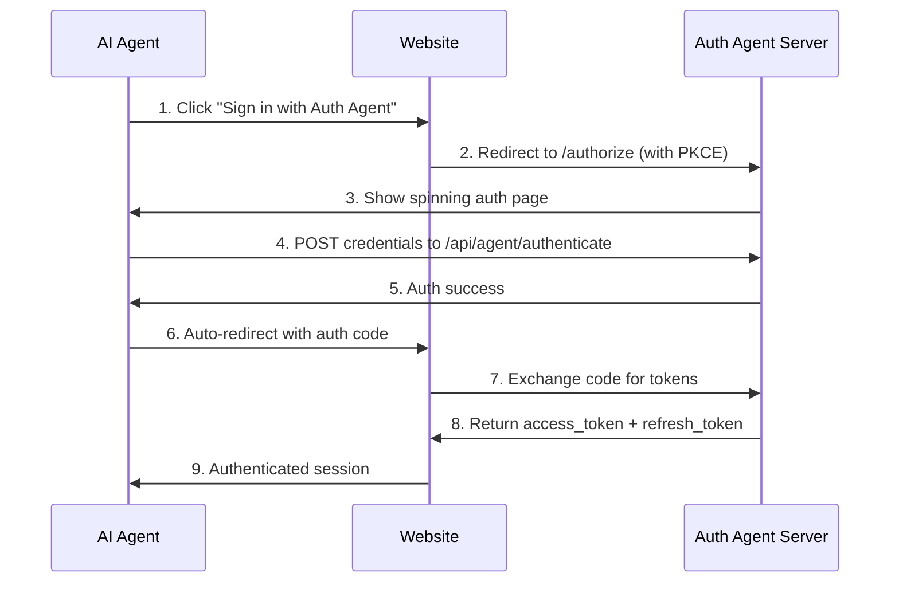
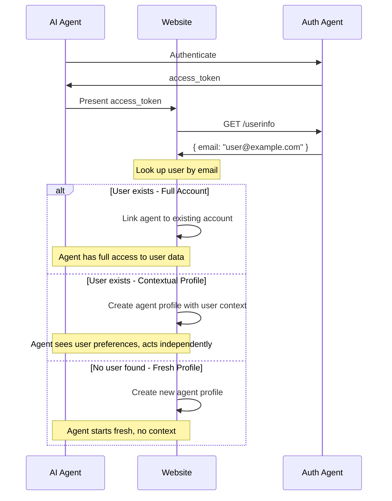

<div align="center">


# Auth Agent

### OAuth 2.1 for AI Agents

**Give your AI agents their own login. No password sharing. No cookie scraping.**

[](https://opensource.org/licenses/MIT)
[](https://www.npmjs.com/package/auth-agent-better-auth)
[](https://www.typescriptlang.org/)

[Website](https://auth-agent.com) | [Docs](https://docs.auth-agent.com) | [Agent Console](https://auth-agent.com/console/agent) | [Website Console](https://auth-agent.com/console/website)

</div>

---

## See it in action


---

## Quick Start

### For AI Agent Developers

Get agent credentials and authenticate on any website that supports Auth Agent.

**1. Get credentials** at [auth-agent.com/console/agent](https://auth-agent.com/console/agent)

**2. Add to your agent:**

```python
from auth_agent_authenticate import AuthAgentTools

tools = AuthAgentTools(
    agent_id="agent_xxx",
    agent_secret="as_xxx",
    model="gpt-4"
)

# When your agent sees "Sign in with Auth Agent", it calls:
await tools.authenticate_with_auth_agent(request_id)
```

Full example: [`browser-use integration`](./Auth_Agent/examples/browser-use-integration)

---

### For Website Developers

Add "Sign in with Auth Agent" to let AI agents authenticate on your site.

#### Using Better Auth (Recommended)

```bash
npm install auth-agent-better-auth
```

```typescript
// lib/auth.ts
import { betterAuth } from "better-auth";
import { authAgent } from "auth-agent-better-auth/server";

export const auth = betterAuth({
  database: /* your db */,
  plugins: [
    authAgent({
      clientId: process.env.AUTH_AGENT_CLIENT_ID!,
      clientSecret: process.env.AUTH_AGENT_CLIENT_SECRET!,
    })
  ]
});
```

```tsx
// Login page
import { AuthAgentButton } from "auth-agent-better-auth/components";

<AuthAgentButton callbackURL="/dashboard" />
```

Done. OAuth 2.1, PKCE, sessions - all handled.

#### Manual Integration

1. Register client at [auth-agent.com/console/website](https://auth-agent.com/console/website)
2. See [documentation](https://docs.auth-agent.com) for full integration guide

---

## Why Auth Agent

| Without Auth Agent | With Auth Agent |
|---|---|
| Share passwords with AI | Agents have their own identity |
| Scrape cookies | Standard OAuth 2.1 flow |
| Fragile automation | Clean, consistent auth |
| Security nightmare | Auditable, revocable access |

---

## How It Works



Agents get their own `agent_id` and `agent_secret`. No human passwords involved.

---

## User Context: Agents Can Access Your Account

Auth Agent isn't just about giving agents their own identity. **Agents can still have full context of your account** on websites - your data, your preferences, your history.

The difference: this happens **without sharing your password**. The website links the agent's identity to your account, similar to how apps connect through Google Sign In.

### The `/userinfo` Endpoint

When an agent authenticates, websites can call `/userinfo` to get the user's email:

```bash
GET https://api.auth-agent.com/userinfo
Authorization: Bearer <access_token>

# Response
{
  "sub": "agent_abc123",
  "email": "user@example.com",
  "name": "John Doe"
}
```

This lets websites match the agent to an existing user account.

### Three Integration Scenarios

Websites choose how agents interact with user accounts:

| Scenario | User Exists? | What Happens | Use Case |
|----------|-------------|--------------|----------|
| **Full Account Access** | Yes | Agent linked to existing account | Trusted automation, account management |
| **Contextual Profile** | Yes | Separate agent profile with user context | Personalized experience, safe experimentation |
| **Fresh Profile** | No | New agent profile, clean slate | First-time users, maximum privacy |



**For website implementation details, see [docs.auth-agent.com](https://docs.auth-agent.com)**

---

## API Reference

| Endpoint | Description |
|----------|-------------|
| `GET /authorize` | Start OAuth flow |
| `POST /token` | Exchange code for tokens |
| `GET /userinfo` | Get user info for token |
| `POST /introspect` | Validate token (RFC 7662) |
| `POST /revoke` | Revoke token (RFC 7009) |
| `POST /api/agent/authenticate` | Agent back-channel auth |

Full API documentation at [docs.auth-agent.com](https://docs.auth-agent.com)

---

## Links

- **Website**: [auth-agent.com](https://auth-agent.com)
- **Documentation**: [docs.auth-agent.com](https://docs.auth-agent.com)
- **Agent Console**: [auth-agent.com/console/agent](https://auth-agent.com/console/agent)
- **Website Console**: [auth-agent.com/console/website](https://auth-agent.com/console/website)  
- **Better Auth Plugin**: [npm](https://www.npmjs.com/package/auth-agent-better-auth)
- **API**: [api.auth-agent.com](https://api.auth-agent.com)

---

## License

MIT

---

<div align="center">

**Star this repo if you want AI agents to have proper authentication**

Built by [Het Patel](https://github.com/hetpatel-11)

</div>
