<div align="center">


# Auth Agent - OIDC + OAuth 2.1 for AI Agents

**Standardized authentication for web agents and computer using agents**

[](https://opensource.org/licenses/MIT)
[](https://www.typescriptlang.org/)
[](https://workers.cloudflare.com/)
[](https://supabase.com/)

Auth-Agent is an authentication system for web agents and computer using agents such as Browser Use, Comet, ChatGPT Atlas and Browserbase.
Websites can add “Sign in with Auth-Agent” and developers receive an agent_id and agent_secret that their agents use to log in automatically. No human accounts. No password sharing. No scraping.
</div>

---
FAQ:
Can the agent access my account?

Yes. An agent can still have context of your account on a website. It can access your data and preferences with your permission and this is handled by the website that uses Auth-Agent.
This works without using your personal username or password. The website simply links the agent’s identity to your user account, similar to how apps connect accounts through Google Sign In.

Why Auth-Agent matters?

- It gives agents their own secure identity
- It removes the need to give agents your password
- Websites can safely link agents to user accounts so it can have your context 
- Authentication becomes clean and consistent instead of fragile
- No more cookie scraping or manual login automation

Auth-Agent gives agents a simple and secure way to sign in across any website that supports it. It works like Google Sign In but is built specifically for agents instead of humans.

## 🎥 Video Demos

Watch Auth Agent in action:

### Demo: Profilio Website Integration
AI agent authenticating on Profilio platform using browser-use agent.


## ✨ Features

- **🔐 OAuth 2.1 Compliant** - Full implementation with PKCE required
- **🤖 AI Agent Authentication** - Agents authenticate using `agent_id` + `agent_secret`
- **⚡ No User Consent** - Streamlined for autonomous agents (consent handled during onboarding)
- **👤 User Context Awareness** - `/userinfo` endpoint enables websites to link agents to user accounts
- **🎯 Three Integration Scenarios** - Full account access, contextual profiles, or fresh start
- **🎫 JWT Access Tokens** - Stateless token validation with JWT (HS256)
- **🔄 Refresh Tokens** - Long-lived sessions with opaque refresh tokens
- **🔍 Token Introspection** - RFC 7662 compliant token validation
- **🗑️ Token Revocation** - RFC 7009 compliant token revocation
- **📋 OAuth Discovery** - RFC 8414 metadata endpoint
- **🌐 Edge Deployment** - Global deployment on Cloudflare Workers + Supabase PostgreSQL
- **📦 SDK Support** - TypeScript & Python SDKs for easy integration

## 🛠️ Tech Stack

### Backend & Infrastructure
- **[Cloudflare Workers](https://workers.cloudflare.com/)** - Edge serverless platform for OAuth endpoints
- **[Supabase](https://supabase.com/)** - PostgreSQL database for storing clients, agents, and tokens
- **[Hono](https://hono.dev/)** - Fast web framework for Cloudflare Workers
- **[TypeScript](https://www.typescriptlang.org/)** - Type-safe development
- **[JWT (jose)](https://github.com/panva/jose)** - JSON Web Tokens for stateless authentication

### Frontend & Client SDKs
- **[Next.js](https://nextjs.org/)** - React framework for demo websites
- **[React](https://react.dev/)** - UI components and SDK widgets
- **[TypeScript](https://www.typescriptlang.org/)** - Type-safe client SDK
- **[Tailwind CSS](https://tailwindcss.com/)** - Styling for demo websites

### AI Agent Integration
- **[Python](https://www.python.org/)** - Agent SDK
- **[aiohttp](https://docs.aiohttp.org/)** - Async HTTP client for agents

### Database & Storage
- **[Supabase (PostgreSQL)](https://supabase.com/)** - Primary database with row-level security

### Deployment
- **[Vercel](https://vercel.com/)** - Frontend deployment (demo websites)
- **[Cloudflare Workers](https://workers.cloudflare.com/)** - Backend deployment (edge network)

### Security & Cryptography
- **PBKDF2** - Password hashing for secrets
- **SHA-256** - PKCE code challenge hashing
- **HS256** - JWT signing algorithm
- **bcrypt** - Additional credential hashing

## 🔄 Complete OAuth 2.1 Workflow


### Key Differences from Traditional OAuth

**Traditional OAuth (for humans):**
1. User clicks "Sign in"
2. User redirected to auth server
3. **User enters credentials manually** ❌
4. **User approves consent screen** ❌
5. User redirected back with code

**Auth Agent (for AI):**
1. AI Agent clicks "Sign in" (automated)
2. Browser redirected to auth server
3. **Agent detects auth page programmatically** ✅
4. **Agent POSTs credentials via API** ✅
5. Browser auto-redirects back with code

## 🎯 Three Integration Scenarios

Auth Agent provides **user context awareness** through the `/userinfo` endpoint, enabling websites to choose how agents interact with user accounts. Here are the three scenarios:

### Scenario 1: Agent Acts on User's Existing Account 🔗

**When to use:** User wants the agent to manage their existing account (e.g., manage Amazon orders, update profile)

```mermaid
sequenceDiagram
    participant Agent as AI Agent
    participant Website as Website (Amazon)
    participant AuthAgent as Auth Agent

    Agent->>AuthAgent: Authenticate
    AuthAgent->>Agent: access_token
    Agent->>Website: Present access_token
    Website->>AuthAgent: GET /userinfo
    AuthAgent->>Website: { email: "user@example.com" }

    Note over Website: Search for existing user
    Note over Website: ✅ Found user@example.com

    Website->>Website: Link agent to existing account

    Note over Agent,Website: Agent has FULL access:<br/>- Order history<br/>- Saved addresses<br/>- Payment methods<br/>- Account settings
```



**For Agent Users:**
- ✅ Agent can view your purchase history
- ✅ Agent can place orders with saved payment methods
- ✅ Agent can access all your account data
- ⚠️ Full control - use for trusted automation

**For Websites:**
```typescript
// After getting access_token from agent
const userInfo = await fetch('https://api.auth-agent.com/userinfo', {
  headers: { 'Authorization': `Bearer ${access_token}` }
});
const { email } = await userInfo.json();

// Find existing user
const existingUser = await db.users.findOne({ email });

if (existingUser) {
  // Link agent to existing user account
  await db.sessions.create({
    userId: existingUser.id,
    agentId: tokenData.sub,
    accessLevel: 'full'
  });
}
```

---

### Scenario 2: Fresh Agent Profile WITH User Context 

**When to use:** User wants agent to have its own space but benefit from their history (e.g., personalized recommendations, saved preferences)

```mermaid
sequenceDiagram
    participant Agent as AI Agent
    participant Website as Website (E-commerce)
    participant AuthAgent as Auth Agent

    Agent->>AuthAgent: Authenticate
    AuthAgent->>Agent: access_token
    Agent->>Website: Present access_token
    Website->>AuthAgent: GET /userinfo
    AuthAgent->>Website: { email: "user@example.com" }

    Note over Website: Search for existing user
    Note over Website: ✅ Found user@example.com

    Website->>Website: Create NEW agent profile
    Website->>Website: Link to user context (read-only)

    Note over Agent,Website: Agent has SEPARATE profile with context:<br/>- User's saved addresses (reference)<br/>- Personalized recommendations<br/>- User's preferences/settings<br/>- User's rate limits applied
```



**For Agent Users:**
- ✅ Agent gets personalized experience based on your history
- ✅ Agent has its own separate cart/orders
- ✅ Your original account stays untouched
- ✅ Safe for experimental agent tasks

**For Websites:**
```typescript
const { email } = await userInfo.json();
const existingUser = await db.users.findOne({ email });

if (existingUser) {
  // Create separate agent profile
  const agentProfile = await db.agentProfiles.create({
    agentId: tokenData.sub,
    linkedUserEmail: email,
    contextAccess: 'read-only'
  });

  // Agent can read user context but acts independently
  await db.sessions.create({
    profileId: agentProfile.id,
    userContextId: existingUser.id, // Reference only
    accessLevel: 'contextual'
  });
}
```

---

### Scenario 3: Fresh Agent Profile WITHOUT Context 

**When to use:** First-time user or user wants completely fresh agent experience (e.g., testing new website, privacy-focused usage)

```mermaid
sequenceDiagram
    participant Agent as AI Agent
    participant Website as Website (NewService)
    participant AuthAgent as Auth Agent

    Agent->>AuthAgent: Authenticate
    AuthAgent->>Agent: access_token
    Agent->>Website: Present access_token
    Website->>AuthAgent: GET /userinfo
    AuthAgent->>Website: { email: "user@example.com" }

    Note over Website: Search for existing user
    Note over Website: ❌ No user found

    Website->>Website: Create NEW agent profile
    Website->>Website: No context available

    Note over Agent,Website: Agent has FRESH profile:<br/>- No history<br/>- No saved preferences<br/>- Clean slate<br/>- Email stored for audit only
```



**For Agent Users:**
- ✅ Completely fresh start
- ✅ No connection to existing accounts
- ✅ Maximum privacy
- ✅ Good for testing new services

**For Websites:**
```typescript
const { email } = await userInfo.json();
const existingUser = await db.users.findOne({ email });

if (!existingUser) {
  // Create brand new agent profile with no context
  const agentProfile = await db.agentProfiles.create({
    agentId: tokenData.sub,
    email: email, // For identification/audit only
    contextAccess: 'none'
  });

  await db.sessions.create({
    profileId: agentProfile.id,
    accessLevel: 'new'
  });
}
```

---

### 📊 Scenario Comparison Table

| Scenario | User Exists? | Website Decision | Agent Access Level | Use Case |
|----------|-------------|------------------|-------------------|----------|
| **1. Full Account Access** | ✅ Yes | Link to existing account | **Full** - All user data & actions | Trusted automation, account management |
| **2. Contextual Profile** | ✅ Yes | Create agent profile + context | **Contextual** - Read user data, independent actions | Personalized experience, safe experimentation |
| **3. Fresh Profile** | ❌ No | Create new agent profile | **None** - Clean slate | First-time users, maximum privacy |

---

### 🔑 The `/userinfo` Endpoint: Enabling All Scenarios

All three scenarios are powered by the `/userinfo` endpoint:

```bash
# Website calls this after receiving access_token
GET https://api.auth-agent.com/userinfo
Authorization: Bearer <access_token>

# Response (if 'email' scope granted)
{
  "sub": "agent_abc123",
  "email": "user@example.com",
  "name": "John Doe"
}
```

**Key Features:**
- ✅ Returns user email and name
- ✅ Requires valid access token
- ✅ Respects scopes (`email` or `openid` scope required)
- ✅ Follows OAuth 2.0/OIDC standards

**Website Decision Flow:**
1. Call `/userinfo` to get user's email
2. Check if user exists in your database
3. Choose scenario based on your policy:
   - **Scenario 1:** User exists → Link to existing account
   - **Scenario 2:** User exists → Create agent profile with context
   - **Scenario 3:** User doesn't exist → Create fresh profile

---

## 🚀 Quick Start

### For AI Agent Developers

Add Auth Agent authentication to your AI agents in 3 steps:

#### 1. Install the SDK

```bash
# Python (browser-use integration)
pip install aiohttp python-dotenv browser-use

# Get the Auth Agent tools
cd Auth_Agent/examples/browser-use-integration
```

#### 2. Get Your Agent Credentials

Visit the [Auth Agent Console](https://auth-agent.com/console/agent) to create and manage your agent credentials:

1. **Sign up** with Google, GitHub, or Email
2. **Create an agent** to get your `agent_id` and `agent_secret`
3. **Copy credentials** to your `.env` file

**Console:** [https://auth-agent.com/console/agent](https://auth-agent.com/console/agent)

#### 3. Authenticate on Any Website

```python
import os
from auth_agent_authenticate import AuthAgentTools
from browser_use import Agent, ChatBrowserUse

# Initialize with your credentials
tools = AuthAgentTools(
    agent_id=os.getenv('AGENT_ID'),
    agent_secret=os.getenv('AGENT_SECRET'),
    model='gpt-4'
)

# Create authentication task
task = (
    "Go to the website and click 'Sign in with Auth Agent'. "
    "When the spinning authentication page appears, "
    "use the authenticate_with_auth_agent tool to complete authentication."
)

# Run your agent
agent = Agent(task=task, llm=ChatBrowserUse(), tools=tools)
await agent.run()
```

**See full example:** [`Auth_Agent/examples/browser-use-integration/example.py`](./Auth_Agent/examples/browser-use-integration/example.py)

---

### For Website Developers

Add "Sign in with Auth Agent" button to your website in 3 steps:

#### 1. Get OAuth Client Credentials

Visit the [Auth Agent Console](https://auth-agent.com/console/website) to register your OAuth client:

1. **Sign up** with Google, GitHub, or Email
2. **Register a new client** with your website details
3. **Add redirect URIs** (e.g., `https://yourwebsite.com/api/auth/callback`)
4. **Copy your `client_id` and `client_secret`** to your environment variables

**Console:** [https://auth-agent.com/console/website](https://auth-agent.com/console/website)

#### 2. Add the Auth Agent Button

```typescript
// components/AuthAgentButton.tsx
export function AuthAgentButton() {
  const handleSignIn = async () => {
    // Generate PKCE challenge
    const codeVerifier = generateCodeVerifier();
    const codeChallenge = await generateCodeChallenge(codeVerifier);

    sessionStorage.setItem('code_verifier', codeVerifier);

    // Redirect to Auth Agent authorization
    const params = new URLSearchParams({
      client_id: process.env.NEXT_PUBLIC_CLIENT_ID!,
      redirect_uri: `${window.location.origin}/api/auth/callback`,
      response_type: 'code',
      code_challenge: codeChallenge,
      code_challenge_method: 'S256',
      state: crypto.randomUUID(),
    });

    window.location.href =
      `https://api.auth-agent.com/authorize?${params}`;
  };

  return (
    <button
      onClick={handleSignIn}
      className="flex items-center gap-3 rounded-lg
                 bg-gradient-to-r from-orange-500 to-orange-600
                 px-6 py-3 text-white shadow-xl
                 hover:from-orange-600 hover:to-orange-700"
    >
      
      Sign in with Auth Agent
    </button>
  );
}
```

#### 3. Handle the OAuth Callback

```typescript
// app/api/auth/callback/route.ts
export async function GET(request: Request) {
  const { searchParams } = new URL(request.url);
  const code = searchParams.get('code');
  const codeVerifier = sessionStorage.getItem('code_verifier');

  // Exchange authorization code for tokens
  const response = await fetch('https://api.auth-agent.com/token', {
    method: 'POST',
    headers: { 'Content-Type': 'application/json' },
    body: JSON.stringify({
      grant_type: 'authorization_code',
      code,
      code_verifier: codeVerifier,
      client_id: process.env.CLIENT_ID,
      client_secret: process.env.CLIENT_SECRET,
    }),
  });

  const { access_token, refresh_token } = await response.json();

  // Store tokens securely and redirect to dashboard
  // ... your session management logic
}
```

**See full examples:**
- **[Profilio](./Auth_Agent/Profilio)** - Production website with Contextual Profile scenario (user matching, profile linking)
- **[website-integration-example](./website-integration-example)** - Basic integration example

---

## 🎛️ Auth Agent Console

Our self-service console is now live! Both AI agent developers and website owners can register and manage their credentials:

### For Agent Developers:
- ✅ Sign up with Google/GitHub/Email
- ✅ Create and manage AI agent credentials
- ✅ View usage statistics
- ✅ Regenerate secrets
- ✅ Test authentication flows

**Get started:** [https://auth-agent.com/console/agent](https://auth-agent.com/console/agent)

### For Website Owners:
- ✅ Sign up with Google/GitHub/Email
- ✅ Register OAuth clients
- ✅ Configure redirect URIs
- ✅ View authentication logs
- ✅ Manage API keys

**Get started:** [https://auth-agent.com/console/website](https://auth-agent.com/console/website)

## 📚 Documentation

- **[SDK Documentation](./sdk/README.md)** - Client and agent SDKs
- **[Browser-Use Integration](./examples/browser-use-integration/README.md)** - AI agent authentication examples
- **[Demo Websites](./websites/README.md)** - Three integrated demo websites
- **[Hackathon Pitch Guide](./HACKATHON_PITCH.md)** - Presentation materials

## 🔌 API Endpoints

### Public OAuth Endpoints

#### `GET /authorize`
Standard OAuth 2.1 authorization endpoint. Shows spinning page while agent authenticates.

**Query Parameters:**
- `client_id` - OAuth client identifier
- `redirect_uri` - Callback URL
- `response_type` - Must be "code"
- `state` - CSRF protection token
- `code_challenge` - PKCE challenge (S256)
- `code_challenge_method` - Must be "S256"
- `scope` - Optional, defaults to "openid profile"

#### `POST /token`
Exchange authorization code for tokens, or refresh access token.

**Body (authorization_code grant):**
```json
{
  "grant_type": "authorization_code",
  "code": "code_xxx",
  "code_verifier": "...",
  "client_id": "client_xxx",
  "client_secret": "..."
}
```

**Body (refresh_token grant):**
```json
{
  "grant_type": "refresh_token",
  "refresh_token": "rt_xxx",
  "client_id": "client_xxx",
  "client_secret": "..."
}
```

#### `GET /userinfo`
Get user information for a valid access token. **Essential for the three integration scenarios.**

**Headers:**
```
Authorization: Bearer <access_token>
```

**Response:**
```json
{
  "sub": "agent_abc123",
  "email": "user@example.com",
  "name": "John Doe"
}
```

**Notes:**
- Email and name only returned if `email` or `openid` scope was granted
- Enables websites to identify which user the agent represents
- Powers all three integration scenarios (see [Three Integration Scenarios](#-three-integration-scenarios))

#### `POST /introspect`
Validate and get information about a token (RFC 7662).

```json
{
  "token": "eyJhbG...",
  "token_type_hint": "access_token",
  "client_id": "client_xxx",
  "client_secret": "..."
}
```

#### `POST /revoke`
Revoke an access or refresh token (RFC 7009).

```json
{
  "token": "eyJhbG...",
  "token_type_hint": "access_token",
  "client_id": "client_xxx",
  "client_secret": "..."
}
```

### Agent Back-Channel Endpoints

#### `POST /api/agent/authenticate`
Agent sends credentials to complete an authorization request.

```json
{
  "request_id": "req_xxx",
  "agent_id": "agent_xxx",
  "agent_secret": "...",
  "model": "gpt-4"
}
```

#### `GET /api/check-status`
Check if agent has completed authentication (used by spinning page polling).

**Query Parameters:**
- `request_id` - The authorization request ID

### Admin Endpoints

#### Agents
- `POST /api/admin/agents` - Create new agent
- `GET /api/admin/agents` - List all agents
- `GET /api/admin/agents/:id` - Get agent details
- `DELETE /api/admin/agents/:id` - Delete agent

#### Clients
- `POST /api/admin/clients` - Create new client
- `GET /api/admin/clients` - List all clients
- `GET /api/admin/clients/:id` - Get client details
- `PUT /api/admin/clients/:id` - Update client
- `DELETE /api/admin/clients/:id` - Delete client

### Discovery Endpoints

- `GET /.well-known/oauth-authorization-server` - OAuth server metadata (RFC 8414)
- `GET /.well-known/jwks.json` - JSON Web Key Set

## ⚙️ Configuration

### Environment Variables

**Important:** All `.env*` files are gitignored for security. Never commit actual credentials to the repository.

Environment variable templates (`.env.example`) are provided for:
- **`Auth_Agent/workers/`** - Auth Agent server configuration (Cloudflare Workers, Supabase, JWT)
- **`website-integration-example/`** - Website integration example with OAuth client credentials
- **`Auth_Agent/examples/browser-use-integration/`** - AI agent credentials (AGENT_ID, AGENT_SECRET, etc.)

To get started:

1. **Copy the relevant `.env.example` file to `.env` (or `.env.local` for Next.js projects):**
   ```bash
   # For the Cloudflare Workers server
   cd Auth_Agent/workers
   cp .env.example .env

   # For browser-use examples
   cd Auth_Agent/examples/browser-use-integration
   cp .env.example .env

   # For website integration example (use .env.local for Next.js)
   cd website-integration-example
   cp .env.example .env.local
   ```

2. **Fill in your actual credentials** in the `.env` file

3. **Create agents/clients** using the provided scripts (see SDK documentation)

### Server Environment Variables

For the Cloudflare Workers server, configure these variables in your `wrangler.toml` and Cloudflare dashboard:

```env
JWT_SECRET=your-secret-key-change-in-production
JWT_ISSUER=auth-agent.com
SUPABASE_URL=https://your-project.supabase.co
SUPABASE_ANON_KEY=your-supabase-anon-key
SUPABASE_SERVICE_ROLE_KEY=your-supabase-service-role-key
```

## 🔒 Security Features

### PKCE (Proof Key for Code Exchange)
OAuth 2.1 **requires** PKCE for all authorization code flows. This prevents authorization code interception attacks.

- Code verifier: Random 128-character string
- Code challenge: SHA-256 hash of verifier
- Method: S256 (SHA-256)

### Credential Hashing
All secrets (agent_secret, client_secret) are hashed with PBKDF2 before storage. Original secrets are never stored in the database.

### JWT Tokens
Access tokens are JWTs signed with HS256, enabling stateless validation. Tokens include:
- `sub` - Agent ID
- `client_id` - OAuth client identifier
- `model` - AI model type
- `scope` - Granted permissions
- `iat` - Issued at timestamp
- `exp` - Expiration timestamp

### Opaque Refresh Tokens
Refresh tokens are random strings stored in the database, allowing easy revocation and token rotation.

### Request Expiration
Authorization requests expire after 10 minutes to prevent replay attacks.

### HTTPS Enforcement
All redirect URIs must use HTTPS (except `localhost` for development).

## 📁 Project Structure

```
Auth_Agent_YC/
├── Auth_Agent/               # Main Auth Agent implementation
│   ├── workers/             # Cloudflare Workers backend
│   │   ├── src/            # Source code
│   │   │   ├── index.ts   # Main Hono router (OAuth endpoints)
│   │   │   ├── routes/    # OAuth route handlers
│   │   │   ├── db/        # Supabase database client
│   │   │   ├── lib/       # Shared utilities (crypto, JWT)
│   │   │   └── templates/ # HTML templates (spinning page, errors)
│   │   └── wrangler.toml  # Cloudflare Workers configuration
│   ├── sdk/                # SDKs for integration
│   │   ├── agent/         # AI Agent SDKs (TypeScript & Python)
│   │   ├── client/        # Client SDK (React components, TypeScript)
│   │   └── server/        # Server SDK (TypeScript)
│   ├── examples/           # Integration examples
│   │   └── browser-use-integration/  # Browser-use agent examples
│   ├── scripts/            # Utility scripts
│   │   ├── create-agent-credentials.js
│   │   └── create-*-client.js/py
│   └── demo/               # Video demonstrations
├── Auth_Agent/
│   └── Profilio/                # Production example - Contextual Profile scenario
│       └── src/                 # Next.js app with user matching
├── website-integration-example/  # Basic website integration example
│   └── src/                     # Next.js app with Auth Agent integration
├── logo/                    # Branding assets
└── README.md                # This file
```

## 🌟 Website Integration Examples

### Profilio - Production Example

**Profilio** is a production-ready Next.js website demonstrating Auth Agent with the **Contextual Profile** scenario:

- ✅ Complete OAuth 2.1 flow with PKCE
- ✅ User email matching via `/userinfo` endpoint
- ✅ Agent profiles linked to user accounts
- ✅ Dashboard showing user context when agent is linked
- ✅ Next.js 15 with App Router
- ✅ Supabase backend integration
- ✅ Full TypeScript implementation

**View the example:** [`Auth_Agent/Profilio`](./Auth_Agent/Profilio)

**Live demo:** [Profilio](https://profilio-z561-het-s-projects-30bce613.vercel.app)

### Basic Integration Example

A simpler Next.js example for getting started:

- ✅ Auth Agent OAuth 2.1 sign-in button
- ✅ Callback handler for OAuth redirect
- ✅ Token exchange API route
- ✅ Session storage with httpOnly cookies
- ✅ Protected dashboard routes

**View the example:** [`website-integration-example`](./website-integration-example)

## 🤝 Contributing

Contributions welcome! This project is designed to standardize AI agent authentication across the web.

## 📄 License

MIT

## 🔗 Links

- **Website**: https://auth-agent.com
- **Documentation**: https://docs.auth-agent.com
- **Agent Console**: https://auth-agent.com/console/agent
- **Website Console**: https://auth-agent.com/console/website
- **Repository**: https://github.com/auth-agent/auth-agent
- **Live API**: https://api.auth-agent.com

---

<div align="center">

**Built with ❤️ by Het Patel for the AI agent community**

Standardizing authentication, one agent at a time.

</div>
